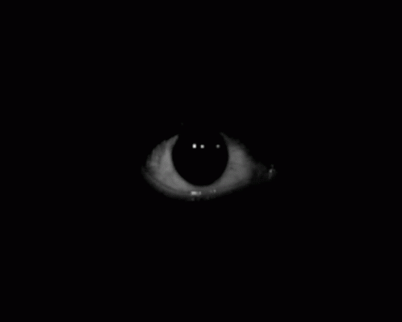
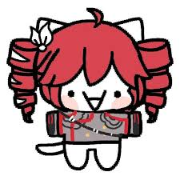

## info
Cat game is a puzzle game using memeory match to achieve your goal of petting a CAT using jacvascript, HTML and CSS 

Features
-Random questions that give or take more time
-background music and noise
-reward at end to pet a CAT
-Fun cutscences
-Mermory system

## How to play Game

 1. Press the play button.
 2. Click two cards.
 3. If they do not match, the timer starts decreasing.
 4. Click True to make the timer increase.
 5. Click False to make the timer decrease.
 6. When all matches been found than click the happy cat.
 7. PET THE CAT.

 ## code overview
MAIN FUNCTIONS
 PlayGame() - loade=d the grid and cell/colums for the game and images for the cells

  cellClicked(cell, row, col)- saving the first click and second click of cell that matched 

 Update  timer - updating the timer to go up or down when true or false is clicked

 objects of array was used for the grid-
## Examples of CODE

const cats = [
  ['😺', '😸', '😹', '🐈‍⬛', '🙀', '😸'],
  ['🐈', '😼', '😽', '🐈', '😽', '😾'],
  ['🙀', '😿', '😾', '😺', '😿', '😺'],
  ['😿', '😼', '😺', '🐟', '😸', '😽'],
  ['🐟', '🐈‍⬛', '😸', '', '🐈', '😼'],
  ['😽', '😾', '😾', '🐈', '😹', '🐈‍⬛']
];

function Playgame() {
  let html = "<table>";

  for (let i = 0; i < cats.length; i++) {
    html += "<tr>";

    for (let j = 0; j < cats[i].length; j++) {
      html += `
        <td onclick="cellClicked(this, ${i}, ${j})">
          
        </td>
      `;
    }

    html += "</tr>";
  }

  html += "</table>";

  document.getElementById("grid").innerHTML = html;

  firstcell = null;
  firstrow = -1;
  firstcol = -1;
  matches = 0;
  attempts = 0;

  countdown = 300;
  timerDirection = "stop";

  clearInterval(interval);
  updateTimerDisplay();

  document.getElementById("messages").innerHTML = `
    

      Click two kitty cards. If they do not match, the timer will start decreasing.
    

  `;

  console.log("Game started.");
  console.log("Timer is showing 5:00 but not moving yet.");
}

// Cell click function
function cellClicked(cell, row, col) {
  if (!cell.innerHTML.includes("kitty.gif")) {
    return;
  }

  cell.innerHTML = cats[row][col];

  if (firstrow === -1) {
    firstcell = cell;
    firstrow = row;
    firstcol = col;

    console.log("First cell clicked:", row, col);
    return;
  }

  attempts++;

  console.log("Second cell clicked:", row, col);
  console.log("Attempts:", attempts);

  if (cats[firstrow][firstcol] === cats[row][col]) {
    matches++;

    console.log("Match found.");
    console.log("Matches:", matches);

    document.getElementById("messages").innerHTML = `
      

        <h1>Kitty is Happy with you</h1>
        
        <audio src="meow.mp3" type="audio/mpeg" autoplay></audio>
      

    `;
  } else {
    console.log("No match found.");
    console.log("Timer will now start decreasing.");

    firstcell.innerHTML = ``;
    cell.innerHTML = ``;

    showQuestion();

    timerDirection = "down";
    startTimer();
  }

  firstcell = null;
  firstrow = -1;
  firstcol = -1;
}

## impletation 
java script is REQUIRED provided above 
HTML file with CSS and java 
A play button and object

CSS-required to help disply table within the javascript

## Example of Struce below

<!DOCTYPE html>
<html lang="en">
<head>
    <meta charset="UTF-8">
    <meta name="viewport" content="width=device-width, initial-scale=1.0">
    <title>Kitty petter stimulator</title>
    <link href="style.css" rel="stylesheet">
    
    <link rel="preconnect" href="https://fonts.googleapis.com">
    

</head>
<body>
   

        <h1> KITTY GAMBLING STIMULATOR</h1>
         
         <!--Button to play game and instructions-->
       <a href="game.html"> <button class="button" class="btn-1" id="play">Start</button></a>
        <button class="button" class="btn-2" id="intructions" onclick=Info()>Instructions</button>
        

    
    

    

</body>
</html>

## info 

all audio used was copyright free
images from the web 
the cat image was created by Chris.c
basically use the game however you like just credit the og creator

## contributing 
Feel free to add or fix any bugs you find with the game welcome any crituqe except about the cat leave the cat alone everything elese though is free game 

## known issues or things for critque
Game might be to boring feeling of adding more danger or something to make it more challenging.

have a very nice day.